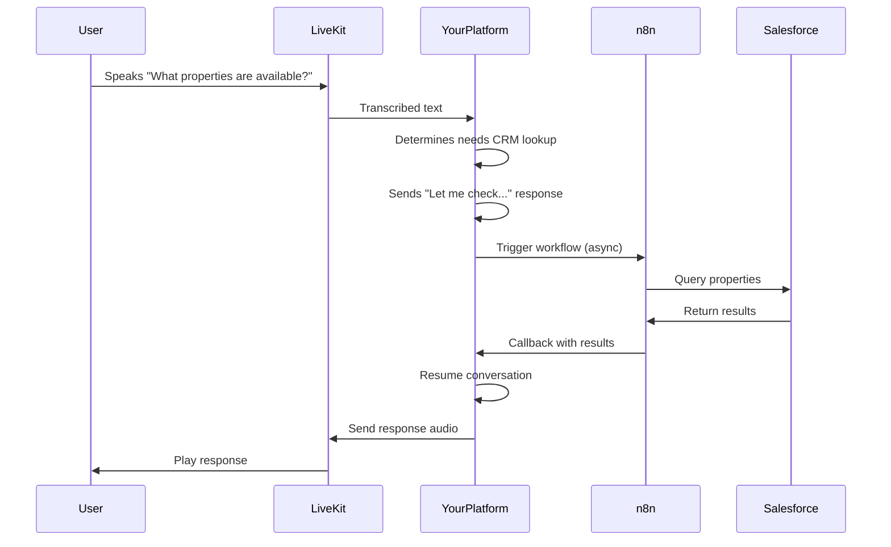

## Critical Implementation Considerations

### 1. The Hybrid Execution Model (Non-Negotiable for Voice)



### 2. Latency Management Strategy

```typescript
// services/conversation.service.ts
async function handleConversationStep(conversationId: string, userInput: string) {
  // 1. Process user input with your core logic
  const nextStep = await this.determineNextStep(conversationId, userInput);
  
  // 2. If integration needed
  if (nextStep.requiresIntegration) {
    // 2a. Send immediate acknowledgment
    await this.sendResponse(conversationId, "Let me check that for you...");
    
    // 2b. Trigger n8n workflow
    await this.agentBuilderService.processIntegrationNode(
      nextStep.agentId,
      nextStep.nodeId,
      conversationId,
      nextStep.inputData
    );
    
    // 2c. Return - conversation will resume when callback arrives
    return;
  }
  
  // 3. Otherwise, continue conversation flow
  await this.continueConversation(conversationId, nextStep);
}
```

### 3. Security Considerations

```typescript
// middleware/n8n-auth.middleware.ts
import { Injectable, NestMiddleware } from '@nestjs/common';
import { Request, Response, NextFunction } from 'express';
import { ConfigService } from '@nestjs/config';

@Injectable()
export class N8nAuthMiddleware implements NestMiddleware {
  constructor(private readonly configService: ConfigService) {}

  use(req: Request, res: Response, next: NextFunction) {
    const apiKey = req.headers['x-n8n-api-key'];
    
    if (!apiKey || apiKey !== this.configService.get('N8N_API_KEY')) {
      return res.status(401).json({ message: 'Unauthorized' });
    }
    
    next();
  }
}
```

### 4. Error Handling Pattern

```typescript
// n8n/error.handler.ts
import { Injectable, Logger } from '@nestjs/common';
import { SentryService } from '../sentry/sentry.service';

@Injectable()
export class N8nErrorHandler {
  private readonly logger = new Logger(N8nErrorHandler.name);

  constructor(private readonly sentryService: SentryService) {}

  handleN8nError(error: any, context: string) {
    this.logger.error(`n8n error in ${context}: ${error.message}`, error.stack);
    
    // Identify error type
    let errorType = 'unknown';
    if (error.response?.status === 401) {
      errorType = 'authentication';
    } else if (error.response?.status === 404) {
      errorType = 'not_found';
    } else if (error.code === 'ECONNREFUSED' || error.code === 'ETIMEDOUT') {
      errorType = 'connection';
    }

    // Send to monitoring
    this.sentryService.captureException(error, {
      extra: { context, errorType },
      tags: { service: 'n8n' },
    });

    // Handle specific error types
    switch (errorType) {
      case 'authentication':
        this.logger.error('n8n authentication failed. Check API key configuration.');
        break;
      case 'connection':
        this.logger.error('Could not connect to n8n service. Is it running?');
        break;
    }

    // Return user-friendly message
    return this.getUserFriendlyMessage(errorType, context);
  }

  private getUserFriendlyMessage(errorType: string, context: string): string {
    switch (errorType) {
      case 'authentication':
        return 'There was an issue connecting to our integration service. Our team has been notified.';
      case 'not_found':
        return 'The requested integration workflow could not be found.';
      case 'connection':
        return 'We\'re experiencing temporary issues with our integration service. Please try again shortly.';
      default:
        return 'An unexpected error occurred. Please try again or contact support.';
    }
  }
}
```

## Performance Optimization Checklist

1. **Critical Path Optimization**
   - [ ] Never wait for n8n in the voice processing path
   - [ ] Always send immediate acknowledgment before triggering n8n
   - [ ] Implement progressive responses (e.g., "Checking... Found it!")

2. **n8n Configuration**
   - [ ] Run in queue mode with Redis backend
   - [ ] Configure worker count based on load (N8N_WORKER_COUNT)
   - [ ] Set proper execution timeout (N8N_EXECUTION_TIMEOUT)

3. **Scaling Strategy**
   - [ ] Horizontal scaling of n8n workers
   - [ ] Auto-scaling based on queue length
   - [ ] Separate n8n instances for different environments (dev/staging/prod)

4. **Latency Reduction**
   - [ ] Co-locate n8n and your application in the same region
   - [ ] Use lightweight models for integrations
   - [ ] Implement caching for frequent queries
   - [ ] Optimize n8n workflow complexity

5. **Monitoring**
   - [ ] Track n8n execution times (alert > 3s)
   - [ ] Monitor queue length and worker utilization
   - [ ] Set up alerts for workflow failures
   - [ ] Log conversation context with execution IDs

This implementation approach ensures you're using n8n strictly for what it does best (integrations) while keeping your platform responsible for the real-time conversation flow. The separation of concerns is clearly defined across all layers of your application, with each component knowing exactly what belongs in n8n and what belongs in your core platform.

The key insight is that **n8n should never be in the critical path of voice processing** - it's always called asynchronously with proper state preservation. This architectural pattern is what enables voice-quality responsiveness while still leveraging n8n's extensive integration library.