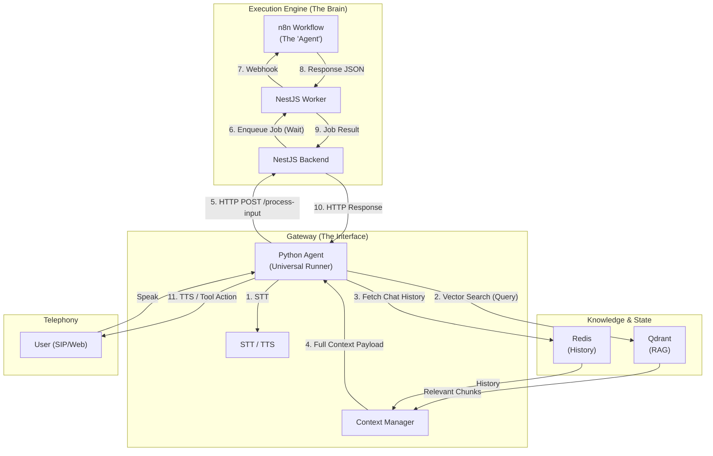

# implementation_plan.md

# [Goal] LiveKit Universal Gateway for n8n Agents

Create a "Universal Voice Gateway" using Python and LiveKit that acts as the voice interface for **n8n Workflows**.
The Python service will be a "dumb runner" that handles media (STT/TTS) and context aggregation (RAG/History), while delegating all business logic and conversation flow to **n8n** via the NestJS Backend.

## User Review Required
> [!IMPORTANT]
> **Architecture Decision**: This plan implements the **Sync-Wrapper Pattern**. The Python Agent will call `POST /api/v1/livekit/process-input` on the NestJS backend and *await* the result. The Backend will handle the async complexity (queueing to worker, waiting for n8n) and return a synchronous response to Python. This keeps the Python codebase strictly focused on LiveKit and Media.

---

## 2. Architecture Overview

### Core Concept: "The Universal Gateway"
The Python Agent is a **generic** runtime that connects any call to an **n8n Workflow**.

- **The "Agent" (n8n Workflow)**:
    - Defined in Frontend, saved to Backend, published to n8n as the "Brain".
    - Contains the *logic*: "If user says X, do Y".
    - Stateless in execution (receives full state in every request).

- **The "Gateway" (Python + LiveKit)**:
    - **One Codebase to rule them all**: No `SalesAgent.py` or `SupportAgent.py`. Just one `UniversalAgent` class.
    - **Responsibilities**:
        1.  **Media**: Handle Audio I/O, STT, and TTS.
        2.  **Context Aggregation**: Before calling n8n, it fetches:
            - **Conversation History** (Redis/DB).
            - **RAG Context**: Queries Qdrant for relevant knowledge *independently*.
        3.  **Proxy**: Bundles `[User Input + History + RAG]` -> Sends HTTP POST to **NestJS Wrapper Endpoint**.
        4.  **Execution**: Receives **Sync Response** from NestJS (after n8n finishes) -> Speaks/Transfers.



---

## 3. LiveKit SIP Trunking

### 3.1 Inbound Calls (Managed by NestJS)
When a user dials your phone number:
1.  **SIP Provider** receives the call.
2.  **LiveKit** receives `INVITE`.
3.  **LiveKit** triggers a `room_started` webhook to **NestJS**.
4.  **NestJS** determines "Who should answer?" (e.g., looks up caller ID in DB).
5.  **NestJS** updates Room Metadata with the **Agent Workflow ID**.
6.  **Python Agent** joins, reads `workflow_id` from metadata, and greets the user.

```json
// Inbound Trunk Configuration (LiveKit)
{
  "trunk": {
    "name": "jibu-inbound",
    "numbers": ["+254XXXXXXXXX"],
    "inbound_numbers_regex": ["^\\+254.*"]
  }
}
```

### 3.2 Outbound Calls (Triggered by NestJS/n8n)
To make an outbound call (e.g., "Call Customer X to confirm order"):
1.  **n8n/NestJS** decides to call.
2.  **NestJS** calls `CreateSIPParticipant` API on LiveKit.
    - Attaches metadata: `{"workflow_id": "wf_123", "customer_id": "cust_ABC"}`.
3.  **LiveKit** dials the number.
4.  **Python Agent** joins the room, reads metadata, and executes the specific workflow.

---

## 4. LiveKit DTMF Handling

### 4.1 Receiving DTMF (IVR)
The `UniversalAgent` listens for DTMF tones to trigger n8n workflows (e.g., "Press 1 for Sales").

```python
# python/telephony/dtmf.py
@agent.on("dtmf_received")
async def handle_dtmf(code: str, participant: Participant):
    # Sends "User pressed 1" to n8n as if it were text
    await nestjs_client.process_input({
        "input": code,
        "type": "dtmf",
        "workflow_id": ctx.job.metadata.get("workflow_id")
    })
```

### 4.2 Sending DTMF
Agens can send tones (e.g., to navigate external IVRs).
- **n8n Action**: `{"action": "send_dtmf", "digits": "1234"}`
- **Python Hander**:
```python
async def execute_action(action: dict):
    if action["type"] == "send_dtmf":
         await ctx.room.local_participant.publish_dtmf(digits=action["digits"])
```

---

## 5. RAG Integration with Qdrant (Independent)

The Python Agent performs RAG *before* calling n8n, injecting the results into the payload.

### 5.1 The RAG Tool
```python
# python/tools/rag.py
class QdrantTool:
    async def search(self, query: str, collection_name: str) -> list[str]:
        # Embed query
        embedding = await self.openai.embeddings.create(input=query)
        # Search Qdrant
        results = await self.qdrant.search(
            collection_name=collection_name,
            query_vector=embedding.data[0].embedding,
            limit=3
        )
        return [hit.payload["text"] for hit in results]
```

### 5.2 Context Builder
```python
# python/agent/context.py
async def build_payload(user_input: str, workflow_id: str):
    # 1. Get History
    history = await redis.get_history(workflow_id)
    
    # 2. Get RAG
    rag_chunks = await qdrant_tool.search(user_input, "knowledge-base")
    
    # 3. Construct Payload
    return {
        "text": user_input,
        "history": history,
        "rag_context": rag_chunks
    }
```

---

## 6. Call Forwarding & Transfer

### 6.1 Cold Transfer (SIP REFER)
For transferring to a human agent or another department.
- **n8n Action**: `{"action": "transfer", "destination": "+254700000000"}`
- **Python Execution**:
```python
from livekit.agents.sip import TransferSIPParticipant

async def transfer_call(destination: str):
     # SIP REFER
     await ctx.room.local_participant.perform_transfer(
         target_uri=f"sip:{destination}@sip.twilio.com"
     )
```

### 6.2 Warm Transfer
1.  **Place Customer on Hold**: Agent stops subscribing to customer audio.
2.  **Dial Supervisor**: Agent creates a new participant (Supervisor).
3.  **Bridge**: If Supervisor accepts, mix audio streams.

---

## 7. NestJS ↔ FastAPI Communication (Sync-Wrapper)

### 7.1 NestJS Controller (`apps/backend`)
Wraps the async BullMQ job into a synchronous HTTP response.

```typescript
// apps/backend/src/livekit/livekit.controller.ts
@Controller('livekit')
export class LiveKitController {
  
  @Post('process-input')
  async processInput(@Body() dto: AgentInputDto) {
    // 1. Create Job ID
    const jobId = `job_${Date.now()}`;
    
    // 2. Add to Queue (Payload includes n8n workflow ID)
    const job = await this.queue.add('deliver-webhook', {
        ...dto,
        jobId 
    });
    
    // 3. Wait for Worker Result (wrapper utility)
    const result = await job.finished(); 
    
    // 4. Return result to Python
    return result; 
  }
}
```

### 7.2 Python Client (`apps/livekit-agent`)
```python
# apps/livekit-agent/src/integration/nestjs.py
class NestJSClient:
    async def process_input(self, payload: dict):
        async with aiohttp.ClientSession() as session:
             # This request will 'hang' for ~1-3s while n8n executes
            async with session.post(f"{API_URL}/livekit/process-input", json=payload) as resp:
                return await resp.json()
```

---

## 8. FastAPI Directory Structure

```text
apps/livekit-agent/
├── project.json               # NX project config
├── pyproject.toml             # Python dependencies
├── Dockerfile                 # Container build
├── .env.example               # Environment template
│
├── src/
│   ├── __init__.py
│   ├── main.py                # FastAPI + Agent Worker entry (Universal Runner)
│   ├── config.py              # Settings 
│   │
│   ├── agent/
│   │   ├── __init__.py
│   │   ├── universal_agent.py # The SINGLE, MAIN Agent Loop 
│   │   └── context.py         # Aggregates RAG + History
│   │
│   ├── tools/
│   │   ├── __init__.py
│   │   ├── rag.py             # Independent Qdrant querying
│   │   └── actions.py         # Standardized actions (Transfer, Hangup)
│   │
│   ├── integration/
│   │   ├── nestjs.py          # HTTP Client (Sync Wrapper) for Backend
│   │   └── qdrant_client.py   # Vector DB access
│   │
│   └── telephony/
│       ├── sip.py             # SIP Trunk helpers
│       └── dtmf.py            # DTMF decoders
```

## 9. Next Steps (Execution)

1.  **Scaffold Python App**: Create `apps/livekit-agent` with the structure above.
2.  **Backend Controller**: Implement `process-input` in NestJS.
3.  **Universal Agent**: Write the loop that listens -> transcribes -> calls NestJS -> speaks.
4.  **Connect**: Test with a real SIP call.
